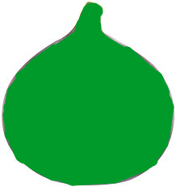

##
Fig
##

To Use Fig, clone this repo and write your code in main.fig

`out-"Hello World"` Print Command

`in-"What's your name?"` Take input and return the input

`str-wasp = "seed";` Declare a string variable.

a fig is a fruit (wow bet you didn't know that, huh?)